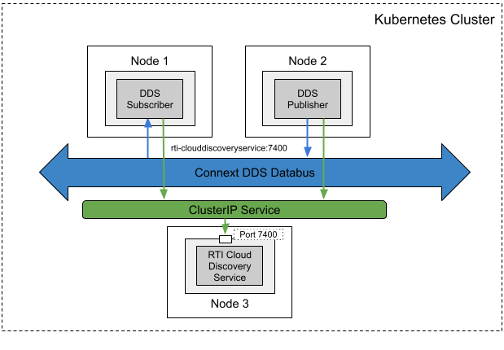

### Discovery without Multicast

#### Problem

You want to make DDS discovery work without multicast. 

The default DDS discovery relies on multicast, and most virtual network solutions of k8s do not support multicast. 

#### Solution

**RTI Cloud Discovery Service (CDS)** enables DDS discovery on a network not supporting multicast. To use CDS, the IP address or DNS name and port number of CDS need to be added in the initial peer lists of DDS applications. 

To resolve the IP unreliability issue of k8s, a **Cluster IP Service** is used. Cluster IP is the default type of k8s service and exposes a pod on a stable internal IP in the cluster. With this, the pod for RTI CDS is reachable by publishers and subscribers via a stable IP address or DNS name (e.g. rti-clouddiscovery:7400). 

#### Required Docker Images
- [RTI Cloud Discovery Service](../dockerfiles/rti_cds)
- [RTI DDS Ping Publisher](../dockerfiles/rti_ddsping_pub)
- [RTI DDS Ping Subscriber](../dockerfiles/rti_ddsping_sub)

#### Steps

##### Create a ConfigMap for RTI License.
`$ kubectl create configmap rti-license --from-file rti_license.dat`

##### Create a Deployment and a Service for Cloud Discovery Service.
`$ kubectl create -f rticlouddiscoveryservice.yaml`

##### Create a Deployment for DDS ping publisher.
`$ kubectl create -f rtiddsping-cds-pub.yaml`

##### Create a Deployment for DDS ping subscriber.
`$ kubectl create -f rtiddsping-cds-sub.yaml`
